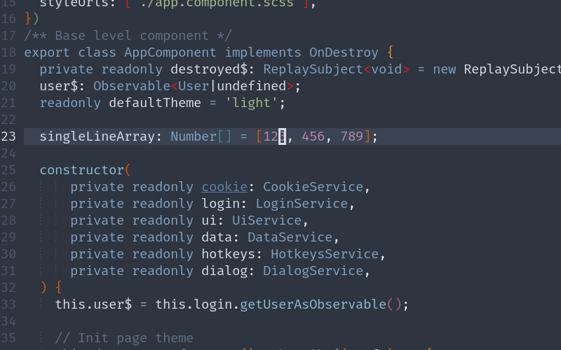

# accio.nvim

A [neovim](https://neovim.io) plugin that summons textobjects, just like magic!

*Warning:* tree-sitter and nvim-treesitter are an experimental feature of nightly versions of Neovim. 
Please consider the experience with this plug-in as experimental until tree-sitter support in Neovim 
is stable! It is recommended using the nightly builds of Neovim or the latest stable version.

## installation

You can install accio with your favorite package manager, or using the default pack feature of Neovim!
This plugin does require [nvim-treesitter/nvim-treesitter](https://github.com/nvim-treesitter/nvim-treesitter).

### Using a package manager

```vim
Plug 'nvim-treesitter/nvim-treesitter', {'do': ':TSUpdate'}
Plug 'tylersaunders/accio'
```

## usage

### pivot_array

Use `<leader>ap` when hovering over a single line array to pivot the array to multiple lines.



## configuration

lua:

```lua
require('accio').setup({})
```

vimscript:

```vim
lua require('accio').setup({})
```

## acknowledgements

inspired by [nvim-treesitter-textobjects](https://github.com/nvim-treesitter/nvim-treesitter-textobjects)
